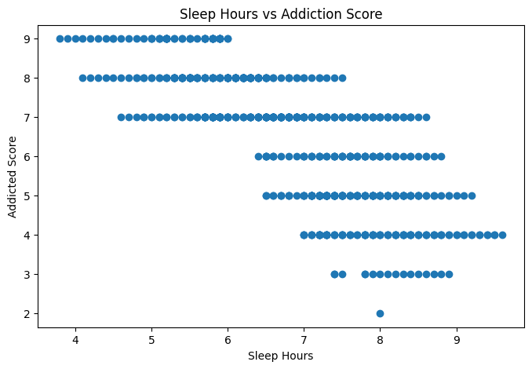
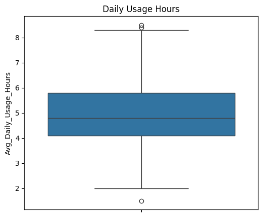
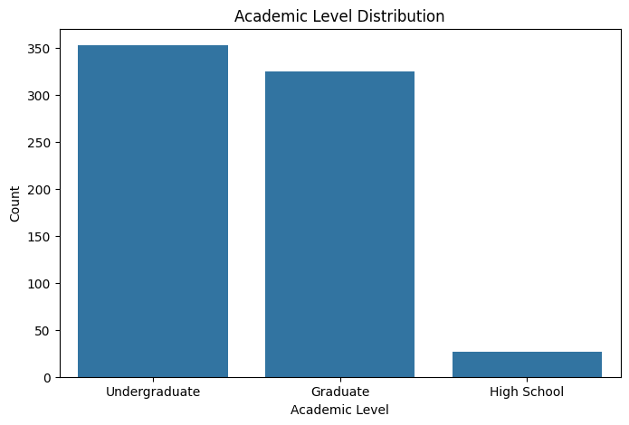
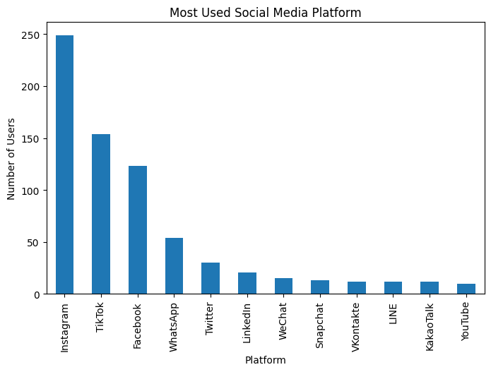

# Student Social Media Addiction Analysis

## Project Overview

This project analyzes student social media usage and its impact on academic performance, sleep, and addiction levels.

The analysis was performed using Python and data visualization techniques to identify meaningful patterns and insights.

## Technologies Used

* Python
* Pandas
* NumPy
* Matplotlib
* Seaborn
* Google Colab

## Dataset

The dataset contains information about students, including:

* Student ID
* Age
* Gender
* Academic Level
* Country
* Average Daily Usage Hours
* Most Used Platform
* Academic Performance
* Sleep Hours Per Night
* Mental Health Score
* Relationship Status
* Conflicts Over Social Media
* Addiction Score

## Project Steps

1. Data Loading
2. Data Cleaning
3. Data Exploration
4. Exploratory Data Analysis
5. Data Visualization
6. Insights and Conclusion

## Visualizations

### 1. Sleep Hours vs Addiction Score

This graph shows the relationship between students' sleep hours and their social media addiction scores.

### 2. Daily Social Media Usage Hours

This visualization shows the daily social media usage hours among students.

### 3. Academic Level Distribution

This graph shows the distribution of students across different academic levels.

### 4. Most Used Social Media Platform

This visualization shows which social media platforms are most commonly used by the students.

## Key Analysis

* Identified the most commonly used social media platforms.
* Analyzed daily social media usage among students.
* Examined the relationship between sleep hours and addiction score.
* Studied the distribution of students across academic levels.
* Explored patterns related to social media addiction.

## Conclusion

The project provides insights into student social media usage and its relationship with sleep and addiction levels. Data visualization helps in understanding the patterns and trends present in the dataset.

## Author

**Rupali Vitnor**

